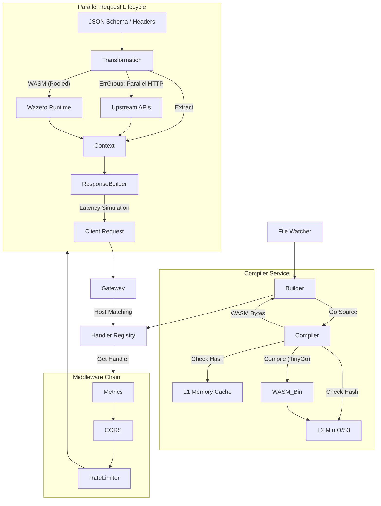

***

# 🌀 MockingGOD

**MockingGOD** is a high-performance, declarative API Gateway and API Mocking Platform written in Go. It uses an **Intermediate Representation (IR)** engine to decouple configuration from execution.

It is designed for scale and developer experience, featuring **zero-downtime hot-reloading**, **upstream proxying**, **parallel execution**, **distributed caching**, and **dynamic user code execution** via WebAssembly (WASM).

A variation of this project serves as the core for [mocc.dev](http://mocc.dev). This is the open-source version.

## ⚠️ Important Note
I mainly work with Python and C/C++. Go is new to me. I built this with support from AI assistants and online resources. Since this project has **user code execution** and **API chaining**, these features can be misused. If you plan to run untrusted code, use caution and double-check all code for exploits. It is recommended to run this in a restricted environment like Docker or a hardened kernel, behind a DMZ. This project is intended for demonstration and testing purposes.

## 🚀 Key Features

### Core Engine
*   **Declarative Configuration**: Define endpoints, validation, logic, and responses entirely in JSON.
*   **Zero-Downtime Hot Reload**: The system detects file changes and recompiles specific routes/WASM binaries without dropping active connections.
*   **Parallel Execution**: Transformation steps (like upstream HTTP calls) are batched and executed concurrently using `errgroup`.
*   **High Performance**: Uses `goccy/go-json` for fast parsing and a global connection pool for low-latency HTTP chaining.

### Advanced Capabilities
*   **Dynamic User Code (WASM)**: Write Go code directly in your JSON. It is compiled to WASM on-the-fly and executed in a sandboxed, pooled runtime (Wazero).
*   **Distributed Caching (S3/MinIO)**: Compiled WASM binaries are hashed and stored in S3/MinIO. This enables instant startup for clusters and prevents "thundering herd" compilation spikes.
*   **Observability**: Built-in **Prometheus** metrics (`/metrics`) tracking RPS, Latency, and WASM execution time.
*   **Traffic Control**: Integrated **Rate Limiting** (Token Bucket) and **CORS** middleware to protect the gateway.
*   **Robust Validation**: Full support for **JSON Schema** validation for request bodies, plus Regex patterns for Headers/Query params.
*   **Network Simulation**: Built-in support for **Fixed Latency** and **Jitter**.

## 🛠️ Prerequisites

*   **Go 1.22+**
*   **TinyGo**: Required for the Dynamic Compiler service.
*   **Docker & Docker Compose**: Recommended for running the full stack (Gateway + MinIO + Prometheus + Grafana).

## 📦 Installation & Run

1.  **Clone the repository**
    ```bash
    git clone https://github.com/axis0047/mockingGOD.git
    cd mockingGOD
    ```

2.  **Install Dependencies**
    ```bash
    go mod tidy
    ```

3.  **Start the Gateway** (Standalone Mode)
    ```bash
    go run cmd/gateway/*.go
    ```
    *Server listens on port `:8080`.*

Here is the updated text for your `README.md`. You can append these sections or replace the existing "Installation & Run" section to make it more comprehensive.

***

## 🐳 Docker Compose (Full Stack)

For the best experience, run the full stack including **MinIO** (Caching), **Prometheus** (Metrics), and **Grafana** (Dashboards).

1.  **Prepare your environment:**
    Ensure you have a `docker-compose.yml` and a `configs/` directory with at least one JSON config.

2.  **Start the Stack:**
    ```bash
    docker-compose up -d
    ```

3.  **Access Services:**

| Service | URL | Credentials | Description |
| :--- | :--- | :--- | :--- |
| **Gateway** | `http://localhost:8080` | N/A | The API traffic entry point. |
| **Metrics** | `http://localhost:9090` | N/A | Raw Prometheus metrics (Internal). |
| **Grafana** | `http://localhost:3000` | `admin` / `admin` | Visual dashboards. |
| **MinIO** | `http://localhost:9001` | `admin` / `password` | S3 Object Browser. |
| **Prometheus** | `http://localhost:9091` | N/A | Metrics database UI. |

4.  **Environment Variables:**
    The gateway is configured via `docker-compose.yml`. Key variables include:

    *   `MINIO_ENDPOINT`: Address of the S3 store (e.g., `minio:9000`).
    *   `MINIO_ACCESS_KEY`: S3 Username.
    *   `MINIO_SECRET_KEY`: S3 Password.

***

## 🏭 Production Guidelines

When deploying MockingGOD to a production environment (Kubernetes, AWS ECS, DigitalOcean), follow these best practices to ensure security and stability.

### 1. Security & Networking
*   **Reverse Proxy (SSL/TLS):** MockingGOD serves HTTP. In production, place it behind **Nginx**, **Traefik**, or an **AWS ALB** to handle SSL termination (HTTPS).
*   **Port Exposure:** Only expose port `8080` (Traffic) to the public. Keep ports `9090` (Metrics), `9000` (MinIO API), and `9001` (MinIO Console) inside your private network (VPC/Cluster IP).
*   **Credentials:** Change the default MinIO `admin/password` credentials immediately. Use Docker Secrets or Kubernetes Secrets to inject them.
*   **CORS:** While the included middleware permits `*` (all origins) for development convenience, you may want to restrict this to specific domains in the `internal/middleware/cors.go` logic for stricter environments.

### 2. Resource Management
*   **WASM Memory:** User code runs in a sandboxed runtime. While efficient, heavy usage requires RAM. Monitor the **Avg WASM Execution Time** in Grafana.
    *   *Tip:* Adjust `max_instances` in your API config to prevent a single API from consuming all server memory.
*   **CPU:** WASM compilation (on the first request/cache miss) is CPU intensive. Ensure your deployment has enough CPU burst capacity for startup/reloads.

### 3. Storage & Caching
*   **Persistence:** Ensure your MinIO container uses a **Persistent Volume**. If MinIO loses data, the Gateway will have to recompile all WASM binaries on the next restart (slower startup).
*   **Shared Cache:** If running multiple replicas of MockingGOD (e.g., 5 pods in K8s), point them all to the **same MinIO instance**. This ensures that if one pod compiles the code, all other pods get the binary instantly from the cache.

### 4. Observability
*   **Golden Signals:** Use the provided Grafana dashboard to monitor **Request Rate**, **Error Rate**, and **Latency**.
*   **Alerting:** Set up Prometheus alerts for:
    *   High Error Rates (`status=5xx`).
    *   WASM Timeouts (Execution time > configured `timeout_ms`).
    *   Rate Limit Throttling (Spikes in `status=429`).

## ⚡ Quick Start

1.  Create a configuration file `configs/my_api.json`.

    ```json
    {
      "api": "my_api",
      "mode": "ir",
      "version": "v2",
      "rate_limit": {
        "requests_per_second": 10,
        "burst": 20
      },
      "user_code": {
        "inline_source": "package main\n\n//export double\nfunc double(x uint64) uint64 { return x * 2 }\n\nfunc main() {}",
        "timeout_ms": 100
      },
      "routes": [
        {
          "method": "GET",
          "path": "/calc/{val}",
          "transform": {
            "extract": { "num": { "from": "path.val", "as": "x", "type": "int" } }
          },
          "response": {
            "status": 200,
            "body": { "result": "{{double(x)}}" }
          }
        }
      ]
    }
    ```

2.  **Test the Endpoint**:
    Routing is based on the **Host header** matching the `api` field.

    ```bash
    curl -H "Host:my_api.localhost" http://localhost:8080/calc/5
    ```

    **Response:**
    ```json
    { "result": "10" }
    ```

## 🏗️ Architecture



## 📂 Project Structure

```text
.
├── cmd/gateway/           # Entry point, Hot-reload, GC, Build orchestration
├── configs/               # API JSON Configurations
├── internal/
│   ├── adapters/          # Config Parsers (V1/V2)
│   ├── config/            # Loader & Version Detection
│   ├── engine/            # Core Runtime (Router, HTTP, Validation, SafeContext)
│   ├── ir/                # Intermediate Representation Definitions
│   ├── middleware/        # Rate Limiting, CORS, and Prometheus Metrics
│   ├── services/
│   │   ├── compiler/      # Dynamic TinyGo Compiler & Hash Logic
│   │   ├── storage/       # S3/MinIO Client
│   │   └── wasm/          # Wazero Pool Manager & Memory Bridge
│   └── utils/             # Helpers
```

## 📚 Documentation

For a detailed guide on all available configuration parameters, please see the **[Configuration Guide](CONFIG_GUIDE.md)**.

## 🧪 Testing

Run unit tests and the End-to-End (E2E) test suite which compiles a real binary and hits it with requests:

```bash
go test ./... -v
```

***
