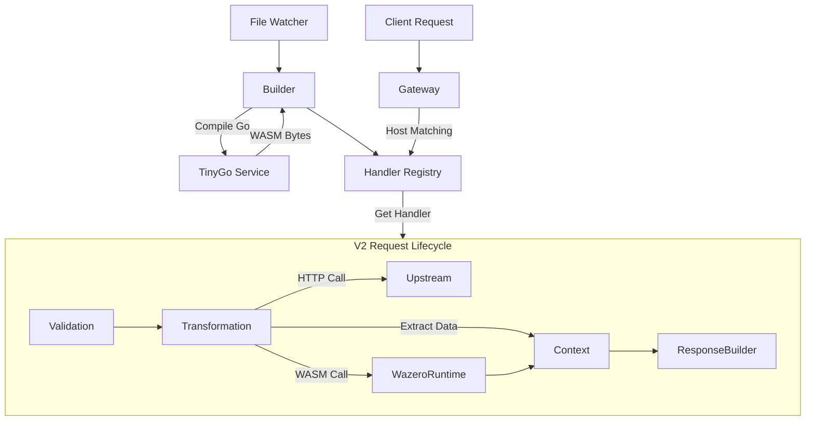

***

# 🌀 MockingGOD

**MockingGOD** is a high-performance, declarative API Gateway and API Mocking Platform written in Go. It uses an **Intermediate Representation (IR)** engine to decouple configuration from execution and allows features such as zero-downtime hot-reloading, upstream proxying, and dynamic user code execution via WebAssembly (WASM).
A variation of this project serves as the core for [mocc.dev](http://mocc.dev) which is an API mocking platform. This is the open source version of it.

## ⚠️ Important Note
I mainly work with Python and C/C++ and Go is new to me. I built with support of AI assistants and online resources. You can see traces of it in old commits. Since this project has user code execution and API chaining; those features can be used for malicious intentions. If you are planning to use this project for running untrusted code use with caution and double check all code for erronous and exploitable code. It is recommended to run this in a restricted enviorment like Docker or hardend kernal. And use a DMZ for hosting this. This project here is intended for demonstration and testing purposes only. 

## 🚀 Key Features

*   **Declarative Configuration**: Define API endpoints, validation logic, and responses entirely in JSON.
*   **Zero-Downtime Hot Reload**: Modify configurations or inline code, and the server updates instantly without dropping connections.
*   **Dynamic User Code (WASM)**: Write Go code directly in your JSON config. It is compiled to WASM on-the-fly and executed securely in a sandboxed runtime.
*   **Validation**: Enforce headers, query parameters, and patterns (Regex).
*   **Transformation**: Extract data from paths/headers and use it in responses.
*   **HTTP Chaining**: Call upstream services and inject their data into your response.
*   **Runtime Pooling**: Efficient management of WASM instances for high throughput.
*   **Protocol Support**: HTTP and Unix Socket Proxying for multiple APIs.

## 🛠️ Prerequisites

*   **Go 1.22+**
*   **TinyGo**: Required for the Dynamic Compiler service (to compile inline Go code to WASM).
    *   [Install TinyGo Instructions](https://tinygo.org/getting-started/install/)

## 📦 Installation & Run

1.  **Clone the repository**
    ```bash
    git clone https://github.com/axis0047/mockingGOD.git
    cd mockingGOD
    ```

2.  **Install Dependencies**
    ```bash
    go mod tidy
    ```

3.  **Start the Gateway**
    ```bash
    go run cmd/gateway/main.go
    ```
    *Server listens on port `:8080`.*

## ⚡ Quick Start

1.  Create a configuration file `configs/my_api.json`:

    ```json
    {
      "api": "my_api",
      "mode": "ir",
      "version": "v2",
      "user_code": {
        "inline_source": "package main\n\n//export double\nfunc double(x uint64) uint64 { return x * 2 }\n\nfunc main() {}",
        "timeout_ms": 100
      },
      "routes": [
        {
          "method": "GET",
          "path": "/calc/{val}",
          "transform": {
            "extract": { "num": { "from": "path.val", "as": "x", "type": "int" } }
          },
          "response": {
            "status": 200,
            "body": { "result": "{{double(x)}}" }
          }
        }
      ]
    }
    ```

2.  **Test the Endpoint**:
    Routing is based on the **Host header** matching the `api` field in your config.

    ```bash
    curl -H "Host:my_api.localhost" http://localhost:8080/calc/5
    ```
    Or use wildcard domains with a proxy like Nginx or HAProxy.

    **Response:**
    ```json
    { "result": "10" }
    ```

## 🏗️ Architecture



## 📂 Project Structure

```text
.
├── cmd/gateway/           # Entry point & Hot-reload logic
├── configs/               # API JSON Configurations
├── internal/
│   ├── adapters/          # Converts JSON -> IR (Intermediate Representation)
│   ├── config/            # Config loading & detection
│   ├── engine/            # The Core Runtime (Router, HTTP, Validation)
│   ├── ir/                # Struct definitions for the Engine
│   ├── services/
│   │   ├── compiler/      # Handles dynamic Go -> WASM compilation
│   │   └── wasm/          # Manages Wazero runtime pool & security
│   └── utils/             # JSONPath and HTTP helpers
└── plugins/               # Directory for manual WASM plugins (optional)
```

## 📚 Documentation

For a detailed guide on all available configuration parameters (Validation, HTTP calls, Extraction rules), please see the **[Configuration Guide](CONFIG_GUIDE.md)**.

## 🧪 Testing

Run the internal unit tests to verify the engine logic:

```bash
go test ./internal/engine/... -v
```
